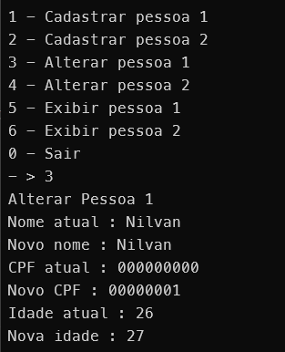
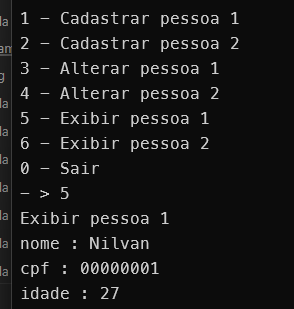

Este é um sistema de cadastro de pessoas, feito em Java. Que permite cadastrar, alterar e exibir 2 pessoas.

Para compilar e executar aplicação faça o clone deste projeto.
Navegue até a pasta src e abra no terminal.
Digite os seguintes comandos:
### Para Compilar
```
javac Main.java
```
### Para Executar
```
java Main.java
```

## Usando o sistema

Para cadastrar Pessoa no menu principal selecione a opção correspondente no menu digitando seu numero e aperte enter, após, siga as instruções para fornecer os dados de cadastro.

Para alterar os dados de uma pessoa ja cadastrada selecione a opção de alterar no menu digitando seu numero, aperte enter e preencha com os novos dados

Para exibir os valores dos usuários cadastrados selecione a opção de exibir digitando o numero correspondente e apertando enter


A lógica de encapsulamento do sistema consiste em nenhum dos atributos serem acessíveis diretamente fora de suas classes
sendo criados métodos getters and setters e setando os atributos como privados.

A classe GerenciadorDePessoas possui logica interna para prevenir o acesso indevido aos objetos pessoa1 e pessoa2, como tentar cadastrar uma pessoa ja cadastrada, alterar ou exibir uma pessoa que não foi cadastrada ainda.

Assim como a classe Main também trata esse tipo de problemas. Verificando se o getPessoa1,getPessoa2 retorna null informando pessoa não cadastrada.